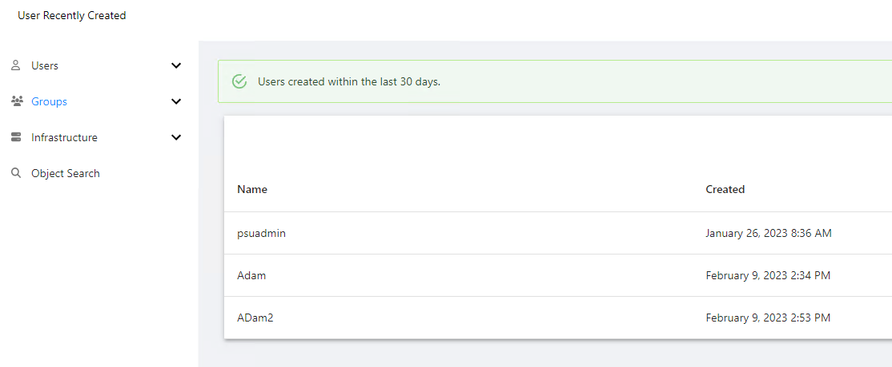

# PowerShell Universal Active Directory Dashboard

Active Directory tools built with PowerShell Universal. Reset passwords, restore deleted users, manage group membership and search for objects.

## General Tools

- Object Search

## User Tools

- Search Users
- View Inactive Users
- Reset Password
- Restore Deleted Users

## User Reports

- Users without Managers
- Recently Changed Users
- Recently Created Users 

## Group Tools

- Search Groups
- Manage Group Membership

## Infrastructure Tools

- Search Computers
- View Domain Controllers

## Usage

The `ActiveDirectory` module is required. All Active Directory commands run under the context of the PowerShell Universal service account. You can specify alternate credentials for the dashboard to run as another user. 

## Role-Based Access

- Administrator - Administrators have access to the entire dashboard. 
- AD Admin - UD Admin have access to the entire dashboard but no access to the admin console. 
- AD Users - Has access to user functionality.
- AD Groups - Has access to group functionality. 